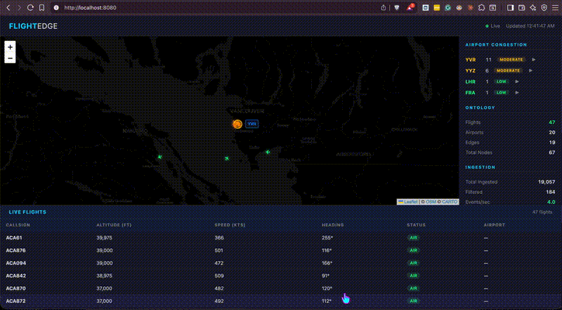

# FlightEdge

FlightEdge is a real-time flight ontology and query service designed for constrained edge environments. It ingests OpenSky state vectors, maintains an in-memory graph, exposes a low-latency HTTP API, and accepts remote collector batches through a versioned gRPC stream.



## Project status

FlightEdge is currently a systems and MLOps foundation, not a trained machine-learning product. The `/api/v1/predict/{id}` endpoint uses an explainable heuristic over route, airline, time-of-day, congestion, and weather inputs. The live OpenSky feed supplies positional state but not all of those features, so predictions are only as complete as the data loaded into the ontology.

That boundary is intentional: it gives the project a testable serving and operations layer before a model registry, offline training pipeline, and deployment policy are added.

## What it demonstrates

- Concurrent, indexed graph queries with eviction-safe secondary indexes
- Polling and batch ingestion with OAuth2 or anonymous OpenSky access
- Edge resource controls, retention, degradation, and memory tests
- Prometheus metrics, alert rules, and a provisioned Grafana dashboard
- Multi-stage, non-root Docker packaging with health checks
- Race-tested CI, linting, load tests, benchmarks, and performance regression gates

The scoped latency gate runs a mixed workload against 10,000 flight nodes with 10 concurrent workers and requires P99 below 50 ms and throughput above 1,000 queries/second. A separate 50-worker test characterizes saturation without presenting it as the same SLO. Performance is hardware-sensitive; run `make test-performance` on the intended deployment target before making production claims.

## Quick start

Requirements: Go 1.22+ or Docker with Compose v2.

```bash
# Deterministic tests, including the race detector
make test

# Run locally without an external API call
ENABLE_INGESTION=false go run ./cmd/flightedge

# In another terminal
curl http://localhost:8080/health
curl http://localhost:8080/api/v1/stats
```

The dashboard is available at [http://localhost:8080](http://localhost:8080).

### Core and collector demo

The default `flightedge` binary still polls OpenSky locally. To demonstrate the edge-to-core path, run a core without local polling and connect a collector in a second terminal:

```bash
# Terminal 1: HTTP dashboard/query API plus gRPC ingestion at :9091
make run-core

# Terminal 2: polls OpenSky and streams filtered batches to the core
FLIGHTEDGE_CORE_GRPC_ADDR=localhost:9091 make run-collector
```

Each collector sends ordered batches with a source ID and sequence number. The core acknowledges a batch only after updating the ontology. If an acknowledgement is lost, retrying the same sequence is safe. Current scope: collector delivery has bounded in-memory retries only; it does not persist an offline queue. The collector uses plaintext gRPC for localhost/private-network development. Do not expose port `9091` publicly without adding mTLS.

### Docker

From the repository root:

```bash
# Application and Prometheus
ENABLE_INGESTION=false docker compose -f docker/docker-compose.yml up --build

# Add Grafana at http://localhost:3000 (admin / admin by default)
ENABLE_INGESTION=false docker compose -f docker/docker-compose.yml --profile monitoring up --build
```

Prometheus is available at [http://localhost:9090](http://localhost:9090). Change `GRAFANA_PASSWORD` before using the monitoring profile outside local development.

## Configuration

```bash
# Server
HTTP_ADDR=0.0.0.0
HTTP_PORT=8080
GRPC_ADDR=0.0.0.0
GRPC_PORT=9091

# OpenSky OAuth2 (optional; anonymous access also works)
OPENSKY_CLIENT_ID=your_client_id
OPENSKY_CLIENT_SECRET=your_client_secret

# Ingestion
ENABLE_INGESTION=true
POLL_INTERVAL=10s

# Edge controls
MEMORY_MODE=normal
MEMORY_LIMIT_MB=512
DATA_RETENTION_HOURS=6
MAX_NODES=50000
```

Secrets belong in environment variables or an ignored local `.env`/`credentials.json`; neither is copied into the Docker build context.

## Architecture

```text
OpenSky API -> local processor -------------------> ontology graph -> indexed query engine -> HTTP API
                 OR                                      |                         |
edge collector -> gRPC FlightIngestService -------------+-> expiry / limits       +-> Prometheus
                                                                                       |
                                                                                   Grafana + alerts
```

| Component | Responsibility |
|---|---|
| `internal/ingestion` | OpenSky authentication, rate limiting, retries, filtering, batching |
| `internal/rpc/ingest` | Versioned gRPC collector protocol, acknowledgement, and sequence de-duplication |
| `internal/ontology` | Concurrent typed graph, relationships, secondary indexes |
| `internal/query` | Airport/airline indexes, paths, congestion, heuristic delay estimates |
| `internal/edge` | Memory monitoring, retention, node limits, compression, startup controls |
| `internal/metrics` | Prometheus-format application and Go runtime metrics |
| `docker` | Runtime image, Compose stack, alert rules, Grafana provisioning |

## API

| Endpoint | Method | Description |
|---|---|---|
| `/health` | GET | Health check |
| `/ready` | GET | Readiness check |
| `/live` | GET | Liveness check |
| `/metrics` | GET | Prometheus metrics |
| `/api/v1/flights` | GET | List flights |
| `/api/v1/flights/{id}` | GET | Get a flight path |
| `/api/v1/airports/{code}` | GET | Get flights by airport |
| `/api/v1/delayed` | GET | Get delayed flights |
| `/api/v1/predict/{id}` | GET | Get the current heuristic delay estimate |
| `/api/v1/congestion` | GET | List airport congestion |
| `/api/v1/congestion/{code}` | GET | Get airport congestion and estimate |
| `/api/v1/stats` | GET | Service and edge statistics |

## gRPC ingestion contract

`proto/flightedge/v1/flight_ingest.proto` defines `FlightIngestService.StreamFlightStates`, a bidirectional stream. A request contains `source_id`, a monotonically increasing `sequence`, and filtered `FlightState` values. The response reports accepted/rejected counts for that sequence. Generated Go stubs live in `gen/` and are intentionally checked in, so a normal build does not require the protobuf toolchain.

```bash
make proto # requires Buf 1.57.2; validates and regenerates the stubs
```

## Validation

```bash
make test              # deterministic race-tested suite
make lint              # vet plus local staticcheck when installed
make test-performance  # hardware-sensitive SLO, load, and memory checks
make bench             # benchmark functions only
make docker-build      # production image
make proto             # lint and regenerate protobuf/gRPC stubs
```

CI runs unit/race tests, `golangci-lint`, performance gates, load tests, binary builds, and a container smoke test that verifies health plus the packaged dashboard.

## MLOps roadmap

The next ML phase should preserve the working systems layer and add evidence in this order:

1. Build a versioned offline dataset by joining flight states with schedules, observed arrivals, airport context, and weather.
2. Add a reproducible baseline training pipeline, time-based splits, and leakage checks; compare it against the existing heuristic.
3. Track datasets, features, parameters, artifacts, and evaluation reports in a model registry.
4. Implement a versioned inference interface with shadow evaluation before any model replaces the heuristic.
5. Add data-quality, drift, prediction-latency, and outcome-based model-performance monitoring.
6. Promote models through CI/CD only when explicit quality, resource, and rollback gates pass.

This sequence creates credible work across ML platform engineering, deployment, data pipelines, observability, reliability, and distributed/edge systems without claiming an ML model before one exists.

See [docs/EDGE_DEPLOYMENT.md](docs/EDGE_DEPLOYMENT.md) for resource-control details.

## License

[MIT](LICENSE)
